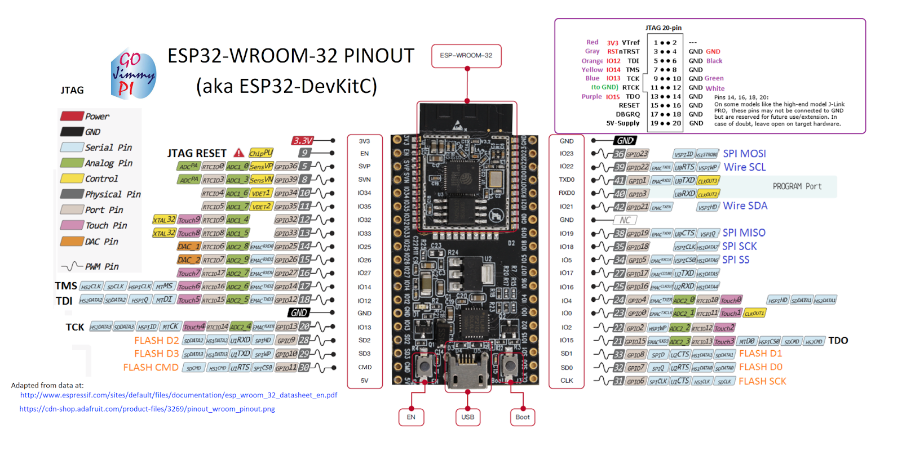
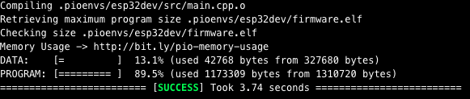
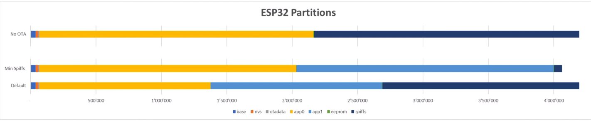

# ESP32 Arduino examples

  

ESP32 BLE Guide: <https://goo.gl/BWU9B8>  
XML Viewer: https://codebeautify.org/xmlviewer#  

    // Create a BLE Heart Rate Measurement  Characteristic
     pHeartRateMeasurement = pHeart->createCharacteristic(
             CHARACTERISTIC_UUID, // Heart Rate Measurement
             BLECharacteristic::PROPERTY_READ   |
             BLECharacteristic::PROPERTY_WRITE  |
             BLECharacteristic::PROPERTY_NOTIFY |
             BLECharacteristic::PROPERTY_INDICATE
             );

See the following for generating UUIDs: <https://www.uuidgenerator.net/>  
The service advertises itself as: 4fafc201-1fb5-459e-8fcc-c5c9c331914b  
And has a characteristic of: beb5483e-36e1-4688-b7f5-ea07361b26a8

## Fake Heart Rate Sensor

Create a esp32BLE Server with "Heart Rate Measurement" Service.
When the Server(esp32) is connected to a Client(Phone), will sends periodic notifications, Server CallBack.  
When the Client is disconnect, the Server stops.  

**Status:** beta  

-   Service: Heart Rate 0x180D <https://is.gd/cbaraY>
    -   Characteristics: Heart Rate Measurement 0x2A37 <https://is.gd/2bgrVt>  

byte heart[8] = { 0b00001110, 60, 0, 0, 0, 0, 0, 0};

-   byte heart[0] --> Flag

    0. BPM = 0
    1. Sensor Contact (2bytes) = 1
    2. Sensor Contact (2bytes) = 1
    3. Energy = 1
    4. RR = 0
    5. RESERVED = 0
    6. RESERVED = 0
    7. RESERVED = 0

-   byte heart[1] --> Heart Rate Measurement Value (uint8)
-   byte heart[2] --> Heart Rate Measurement Value (uint16)
-   byte heart[3] --> Energy Expended
-   byte heart[4] --> RR-Interval
-   byte heart[5] --> RESERVED
-   byte heart[6] --> RESERVED
-   byte heart[7] --> RESERVED

## Heart Rate + Battery

Create a esp32BLE Server with "Heart Rate Measurement" Service and "Battery" Service.  
When the Server(esp32) is connected to a Client(Phone), will sends notifications if request.  
The Battery sensor is only readable, no notifications.  
When the Client is disconnect, the Server stops.  

**Status:** beta  

## PWM 

Create a esp32BLE Server with a New Service and controls the LED_BUILTIN with pwm signal sends by BLE.  

**Status:** beta  

## PWM_Battery

Create a esp32BLE Server with Battery and PWM Services.  
When the Server(esp32) is connected to a Client(Phone), the Client can request the Battery level and write the PWM.  

**Status:** beta  

* * *

**NOTE:** The fields in the above table are in the order of LSO to MSO. Where LSO = Least Significant Octet and MSO = Most Significant Octet.  

**Memory problem over Arduino:**  
  
We need to incress the memory for the APP.  
  
In Arduino IDE, we can do over Tools -> Partition Table.  

Over PlatformIO, we need to edit the platformio.ini file like that:  

    ; Switch between built-in tables
    ; https://github.com/espressif/arduino-esp32/tree/master/tools/partitions
    ; https://github.com/espressif/esp-idf/tree/master/components/partition_table
    [env:esp32dev]
    board_build.partitions = no_ota.csv
