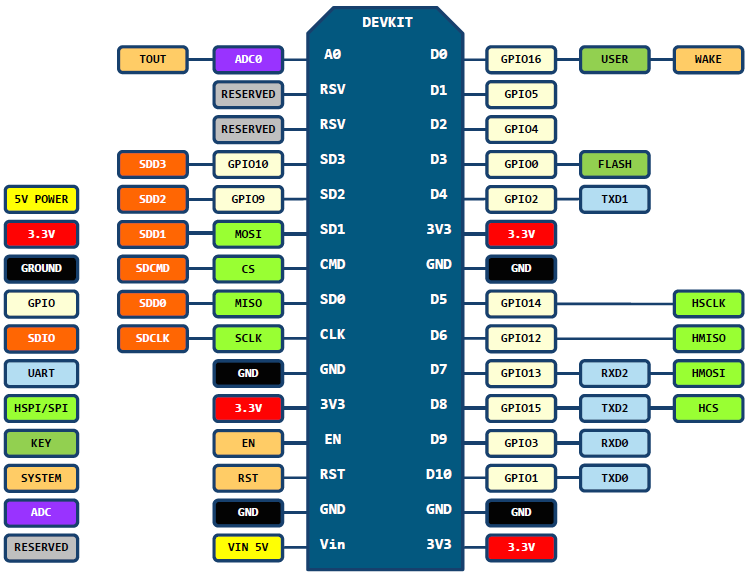

# ESP8266
Projects for **ESP8266** and board **NodeMCU** .

Builded with Arduino IDE: https://goo.gl/sglsYS

Tutorial Esp8266: http://goo.gl/X9LYuh   
         Blynk: http://goo.gl/0rRHtI

### Family

### NodeMCU Boards:
- **v0.9**
This version is no longer available.    

- **v1.0 Amica**
This version is breadboard friendly. It uses the CP2102 serial chip.   

- **v3.0 Lolin**
This version is not breadboard friendly. It uses the CH340 serial chip.  

*DaveCalaway*
